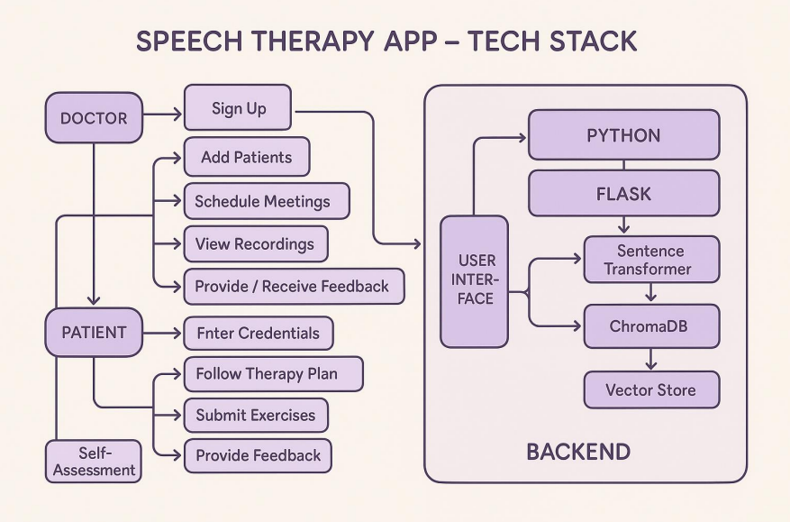
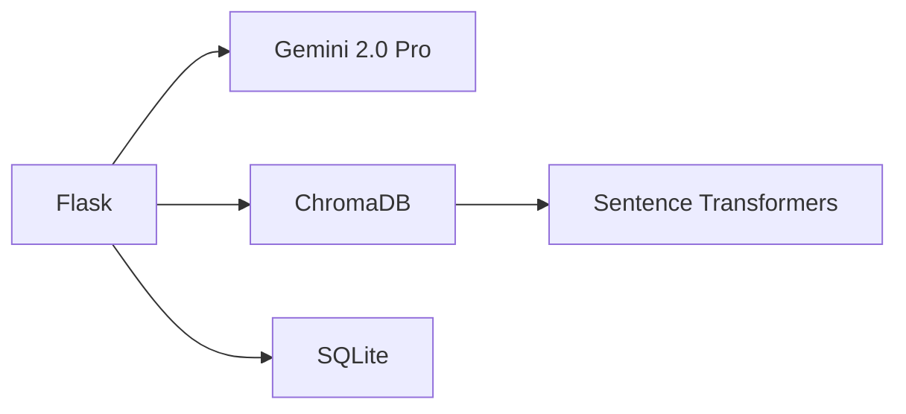

# 🗣️ ReclaimingVoice: AI-Powered Speech Therapy Platform

**🏆 Winning Project of Colossus 2.0 Hackathon at Dr.AIT**  
_Bridging speech therapy gaps through Multi-Agent RAG architecture_

---

## 🚀 Overview

**ReclaimingVoice** revolutionizes speech therapy accessibility using **Retrieval-Augmented Generation (RAG)** and **Multi-Agent LLM architecture** to deliver personalized treatment plans.

Designed for patients with articulation disorders, fluency challenges, and motor speech impairments, our system combines clinical expertise with AI precision while enabling remote care through certified Speech-Language Pathologists (SLPs).

  
_Architecture diagram showing multi-agent RAG workflow from the project presentation_

---

## 🔍 Problem Statement

- 📉 **70% rural accessibility gap** for speech therapy services
- 🧍 **58% patients** report isolation due to impersonal therapy plans
- 🕒 **Manual assessments** lack real-time adaptation to patient progress

---

## 💡 Our Solution: Why RAG + Multi-Agent?

### 🔎 Retrieval-Augmented Generation (RAG)

- **Context-Aware Therapy Plans**  
  Integrates ChromaDB vector store with 150+ peer-reviewed speech therapy documents using Sentence Transformers (`all-MiniLM-L6-v2`):

  ```python
  # From exercise_generator.py
  self.vector_store = ChromaVectorStore(chroma_collection=chromadb_client.get_collection(collection_name))
  self.index = VectorStoreIndex.from_vector_store(self.vector_store, embed_model=self.embed_model)

  ```

- **Factual Accuracy**
  Reduces hallucination risks by grounding responses in medical literature.

---

### 🧠 Multi-Agent Architecture

| Agent Type           | Responsibility                       | Tech Implementation              |
| -------------------- | ------------------------------------ | -------------------------------- |
| **Coordinator**      | Orchestrates workflow between agents | `MultiDisorderCoordinator`       |
| **Generator**        | Creates personalized exercises       | Gemini 2.0 Pro via OpenAI client |
| **Retriever**        | Contextual document fetching         | ChromaDB + FAISS indexing        |
| **Feedback Manager** | Processes user progress data         | SQLite + Custom API endpoints    |

**Key Innovation**: Agents collaborate through LangChain-inspired workflows while maintaining HIPAA compliance via session-based authentication.

---

## ✨ Key Features

1. **Adaptive Therapy Engine**

   - Dynamically adjusts difficulty based on patient progress logs
   - Real-time emotional tone detection using semantic analysis

2. **Multi-Disorder Support**

   ```python
   # From coordinator.py
   self.agents = {
       "articulation": DisorderAgent("Articulation"),
       "fluency": DisorderAgent("Fluency_disorders"),
       "voice": DisorderAgent("Voice_disorders")
   }
   ```

3. **Hybrid Human-AI Workflow**

   - Automated weekly plans generated via RAG
   - SLP dashboard for remote monitoring

---

## 🛠 Tech Stack

### Backend



### Frontend

- React + Tailwind CSS
- Real-time audio processing Web API

---

## 📥 Installation

```bash
git clone https://github.com/yourusername/ReclaimingVoice.git
cd ReclaimingVoice
pip install -r requirements.txt
```

### 🔐 Environment Setup

Create a `.env` file:

```env
GEMINI_API_KEY="your_api_key"
CHROMA_DB_PATH="./chroma_db"
```

---

## 🌟 Usage Workflow

1. **Patient Onboarding**

   ```http
   POST /register-patient
   {
     "username": "john_doe",
     "disorder_type": "articulation"
   }
   ```

2. **RAG-Powered Assessment**

   - Queries ChromaDB using semantic search
   - Generates 4-week plan via Multi-Agent collaboration

3. **Progress Tracking**

   ```python
   # From app.py
   @app.route("/submit-feedback", methods=["POST"])
   def submit_feedback():
       # Stores feedback in SQLite + ChromaDB
   ```

---

## 🙌 Acknowledgements

- Colossus 2.0 Hackathon Team
- OpenAI & Google Gemini APIs
- ChromaDB, LangChain, FAISS
- All contributing mentors and faculty

```

```
